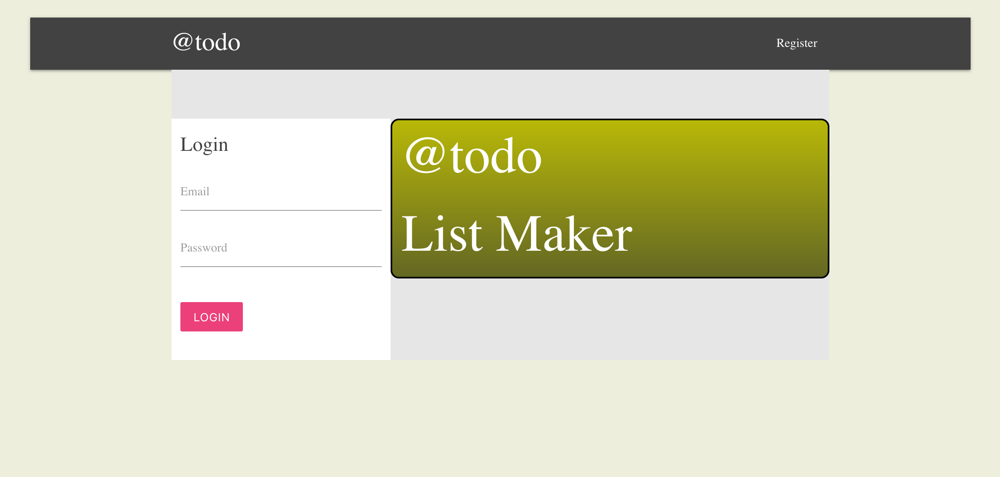
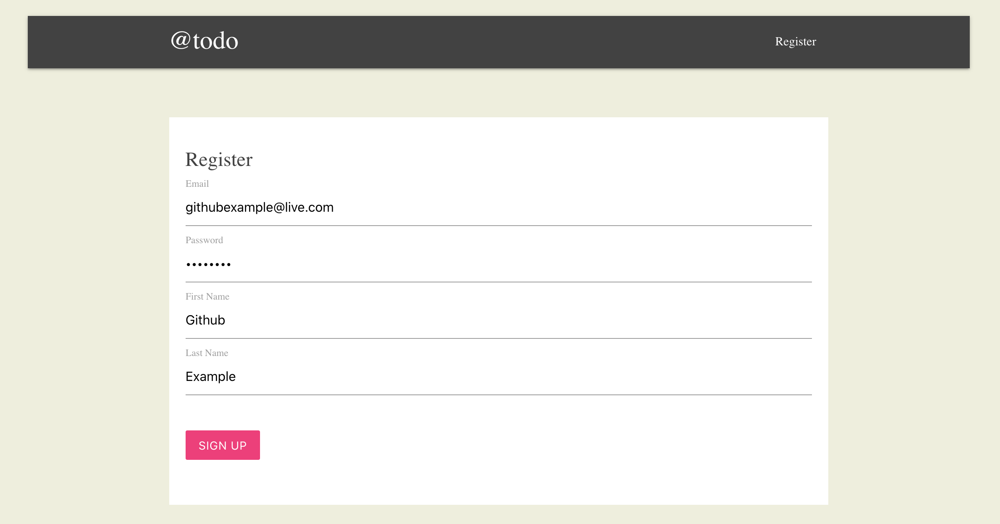
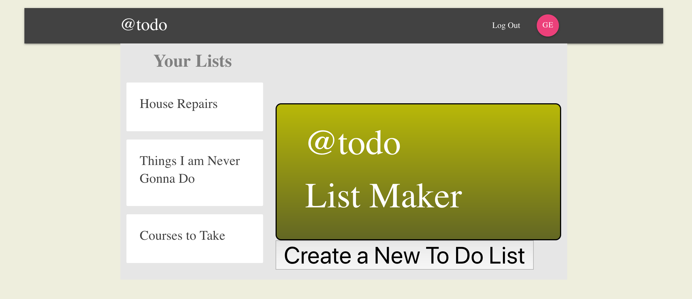
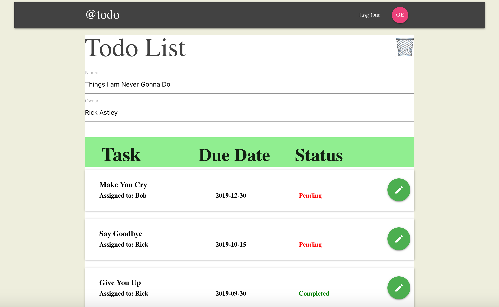
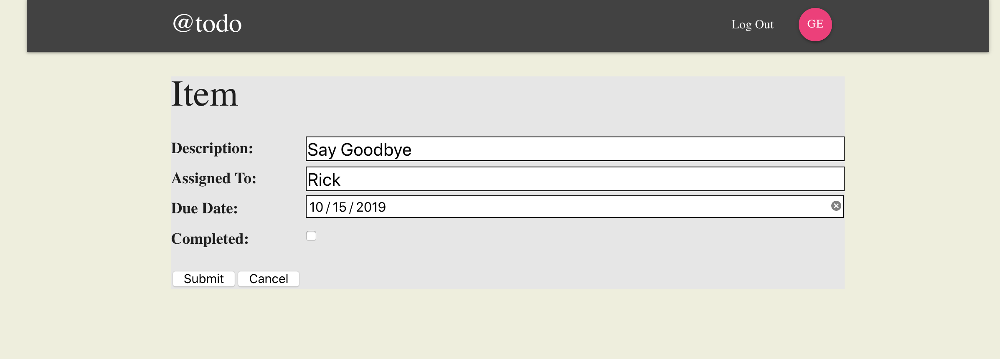
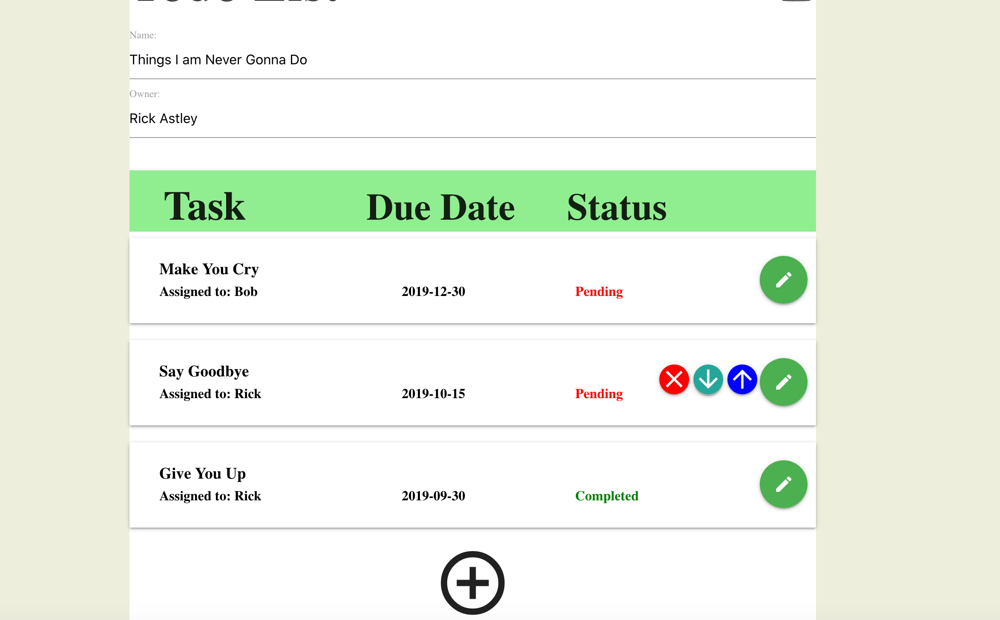
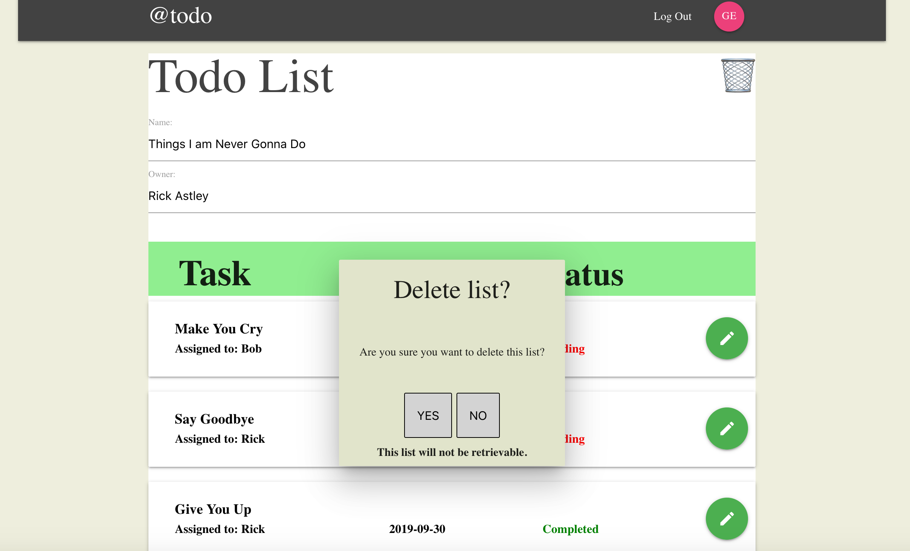
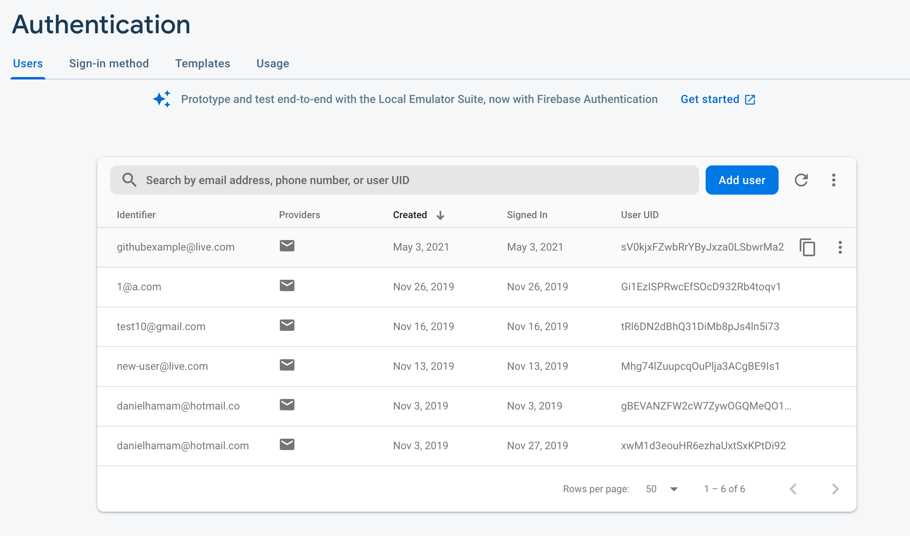
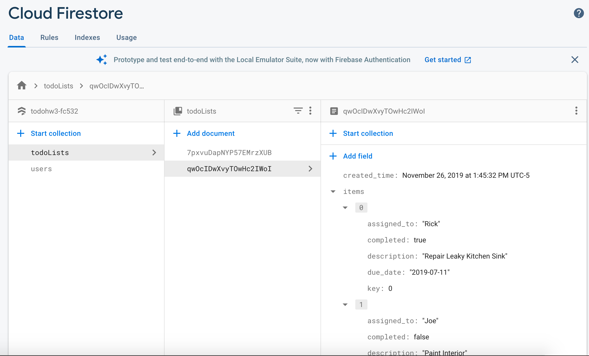

# Daily to-do list Creator

Live version of website: https://danielhamam.github.io/TodoList-React-Redux/

This web application features the creation of daily to-do lists for users to keep tasks in mind. Users can create a new account with their preferred email to log 
in and out as to save their tasks. They can move sub-tasks up and down by their priorities, and mark a task as completed when they are done. They can also 
delete/add new tasks at their free will. User authentication and data is managed by Google's Firebase/Firestore. Please see the last two screenshots to view how
the database is structured.

•	Tools used:   JavaScript,   React,   Redux,   NoSQL,   HTML/CSS,   Materialize

# Firebase/Firestore

